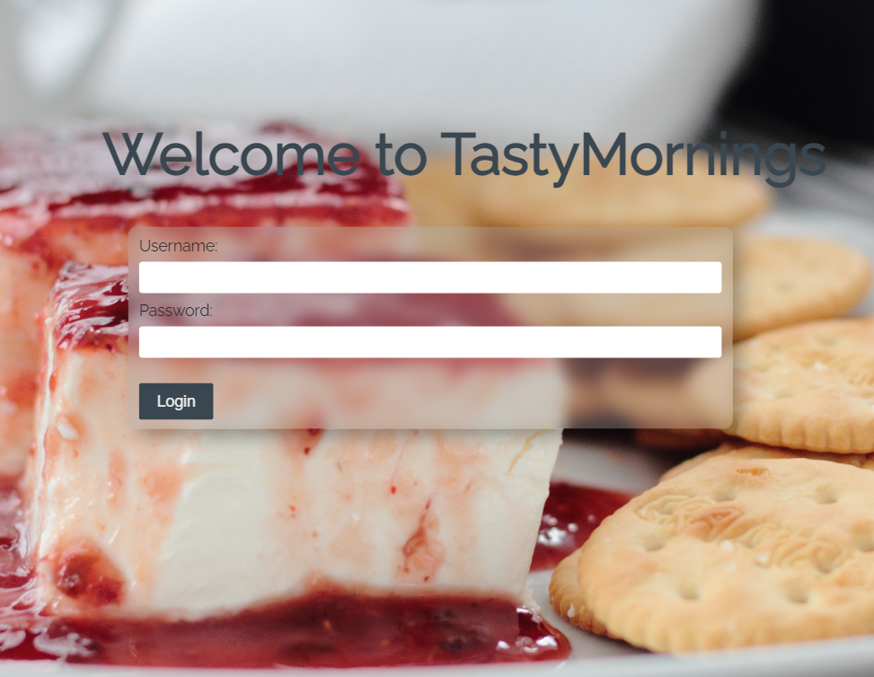
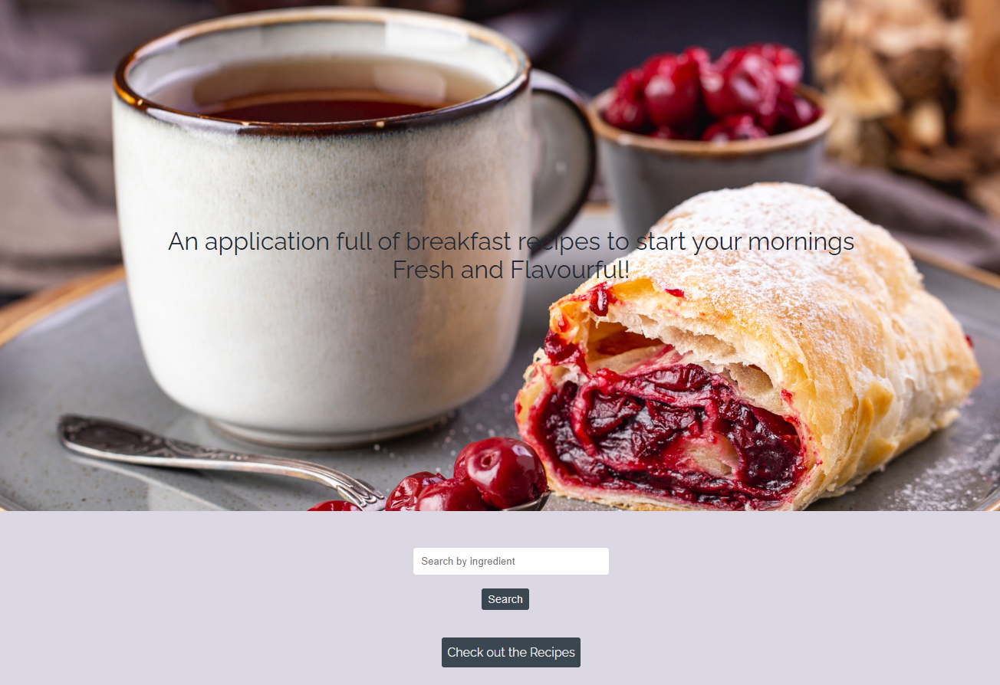
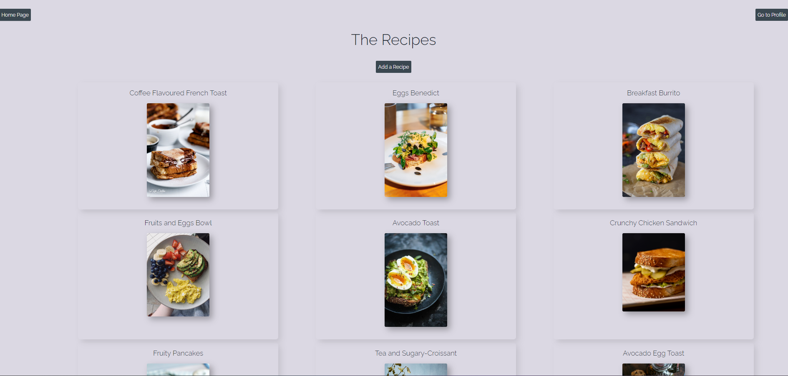
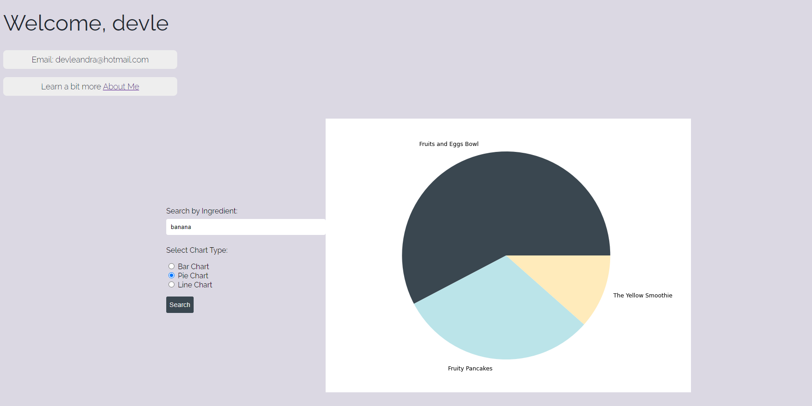

# TastyMornings

A Django based web application, deployed on Heroku. Database operations are performed using SQL queries within the application.

### Key Features
1. Users can login and logout
2. Search for recipe by ingredient
3. Displays the list of all recipes
4. Users can add a recipe including Name, Picture, Ingredients, Cooking time and a small description
5. Users have their own profile view where data visualization is displayed on the cooking time depending on ingredient





## Tech Stack used
- HTML and CSS
- Python
- Django
- SQL Database

# Getting Started

1. Python needs to be installed
2. Check requirements.txt file

# Installation

1. Clone the repo
   ```sh
   git clone https://github.com/LeandraMT/django_app_TastyMornings.git
   ```
2. Install the requirements
   ```sh
   pip install -r requirements.txt
   ```
3. Migrate the database
   ```sh
   python manage.py migrate
   ```
3. Run the local server
   ```sh
   python manage.py runserver
   ```

### Media





# Check the project live
<a href="https://tastymornings-ae401e6582be.herokuapp.com/">TastyMornings</a>

To login please use the following credentials:
- username: demo
- password: Demo123